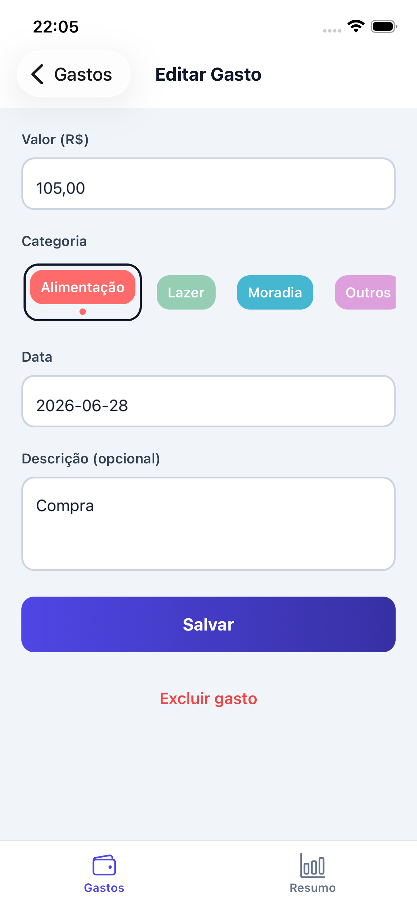

# Expense Tracker

> A fully offline personal finance mobile app built with React Native, Expo SDK 56, and TypeScript — no backend, no cloud, no internet required.

[](https://github.com/thiagomorgado/expense-tracker/actions/workflows/ci.yml)


---

## What it does

Log every expense in seconds. Track spending by category. Navigate month-by-month. See a live pie chart that updates the moment you save a new entry — all stored locally on the device using SQLite.

---

## Screenshots

| Expense List | Add Expense | Monthly Summary | Categories |
|:---:|:---:|:---:|:---:|
|  |  |  |  |

---

## Features

- **Add / Edit / Delete expenses** — amount, category, date, optional description
- **Category system** — 6 built-in defaults (Food, Transport, Housing, Leisure, Health, Other); create custom categories with name, color, and emoji icon
- **Monthly totals** — navigate forward/backward through any month; per-category breakdown
- **Live pie chart** — auto-updates on every add, edit, or delete with no manual refresh
- **Fully offline** — zero network calls; all data lives in an on-device SQLite database
- **Delete guards** — categories with linked expenses cannot be deleted; default categories are protected
- **Category live preview** — badge preview updates in real time as you type the name or pick a color

---

## Tech Stack

| Layer | Technology | Why |
|---|---|---|
| Framework | Expo SDK 56 (managed workflow) | No native builds needed; reproducible across machines |
| Language | TypeScript 6.0 strict | Full type safety end-to-end; zero `any` |
| Database | `expo-sqlite` v2 (WAL mode) | Relational queries, JOINs, FK constraints, ACID transactions |
| Navigation | React Navigation v7 — bottom tabs + native stack | Platform-native transitions |
| Charts | `react-native-gifted-charts` | Skia-free pie chart; works in managed Expo workflow |
| State | React Context + custom hooks | Sufficient for single-user app; no external state lib needed |
| Gradients | `expo-linear-gradient` | Native GPU-accelerated gradients |
| Icons | `@expo/vector-icons` (Ionicons) | Bundled with Expo; no extra native modules |
| Design | Custom token system (`src/theme/tokens.ts`) | Single source of truth for colors, spacing, typography |

---

## Architecture

```
src/
├── theme/
│   └── tokens.ts              # Design tokens: colors, spacing, typography, shadows
├── types/
│   └── index.ts               # Shared TypeScript interfaces
├── utils/
│   ├── currency.ts            # R$ formatter + centavos parser (Intl.NumberFormat)
│   └── date.ts                # ISO 8601 helpers, month navigation, display formatters
├── storage/
│   ├── database.ts            # Schema init: PRAGMA foreign_keys, CREATE TABLE, indexes
│   ├── categoryRepository.ts  # Category CRUD + seed + guard logic
│   └── expenseRepository.ts   # Expense CRUD + monthly aggregation via GROUP BY
├── context/
│   └── AppContext.tsx         # expenseVersion counter — reactive signal for all hooks
├── hooks/
│   ├── useExpenses.ts         # Expense list + write operations; re-fetches on version bump
│   ├── useCategories.ts       # Category list + create/delete with local version
│   └── useMonthlySummary.ts   # Monthly aggregation; subscribes to expenseVersion
├── components/
│   ├── common/                # EmptyState, ConfirmDialog, MonthNavigator
│   ├── categories/            # CategoryBadge, CategoryPicker, CategoryPreview
│   ├── expenses/              # ExpenseForm, ExpenseItem
│   └── charts/                # SpendingChart (pie + legend)
├── screens/                   # ExpenseList, AddExpense, EditExpense, CategoryManagement, MonthlySummary
└── navigation/
    └── AppNavigator.tsx       # Tab + stack navigator with typed param lists
```

---

## Key Engineering Decisions

### Money as integers
All amounts are stored as integer centavos (`R$ 45,90` → `4590`). No floating-point arithmetic anywhere in the data layer. This is the same approach used by Stripe, Shopify, and virtually every serious payment system.

### Reactive updates without external state management
Instead of Redux or Zustand, a single `expenseVersion: number` counter lives in React Context. Every write operation increments it. All hooks (`useExpenses`, `useMonthlySummary`) declare it as a dependency — when it changes, they re-fetch from SQLite. The chart updates automatically the instant a new expense is saved, with zero manual refresh logic.

### SQLite with foreign key enforcement
```sql
PRAGMA foreign_keys = ON;

CREATE TABLE expenses (
  id          INTEGER PRIMARY KEY AUTOINCREMENT,
  amount      INTEGER NOT NULL CHECK (amount > 0),
  category_id INTEGER NOT NULL REFERENCES categories(id) ON DELETE RESTRICT,
  date        TEXT    NOT NULL,  -- ISO 8601 YYYY-MM-DD
  ...
);
```
`ON DELETE RESTRICT` prevents orphaned expenses at the database level — not just at the application layer. The `CHECK (amount > 0)` constraint makes invalid data structurally impossible.

### Dates as ISO 8601 strings
Dates are stored as `YYYY-MM-DD` strings, not Unix timestamps. This enables lexicographic sorting (`ORDER BY date DESC`) and month filtering with a single `LIKE 'YYYY-MM-%'` pattern — no date parsing needed in SQL.

### Repository pattern
Database access is isolated in `src/storage/`. Hooks call repository functions; screens call hooks. This means the data layer is independently testable and swappable without touching UI code.

### Design token system
A single `src/theme/tokens.ts` file exports typed constants for every color, spacing value, border radius, shadow, and typography style. No magic numbers in component stylesheets.

---

## Getting Started

**Prerequisites**: Node.js 18+, Expo CLI, iOS Simulator or Android Emulator (or Expo Go on a physical device)

```bash
# Clone and install
git clone https://github.com/YOUR_USERNAME/expense-tracker
cd expense-tracker
npm install

# Run
npm run ios      # iOS Simulator
npm run android  # Android Emulator
npm start        # Expo Go (scan QR with phone)
```

No `.env` files. No API keys. No accounts. It just runs.

---

## Project Stats

| Metric | Value |
|---|---|
| Source files | 26 TypeScript files |
| TypeScript errors | 0 (strict mode) |
| External state libraries | 0 |
| Network requests at runtime | 0 |
| Native modules (manual linking) | 0 |
| Lines of business logic | ~1,200 |

---

## What this project demonstrates

- **SQLite in a mobile app** — schema design, relational queries, FK constraints, indexes, WAL mode
- **TypeScript discipline** — strict mode, typed navigation params, typed SQLite bind values, no `any`
- **Custom hook patterns** — data fetching, optimistic state, reactive re-fetching
- **Offline-first architecture** — everything works with airplane mode on
- **Component-driven UI** — reusable design system with tokens, composable components
- **Data integrity** — money as integers, delete guards, DB-level constraints
- **Product thinking** — meaningful empty states, loading states, 44pt touch targets, live preview

---

## License

MIT
